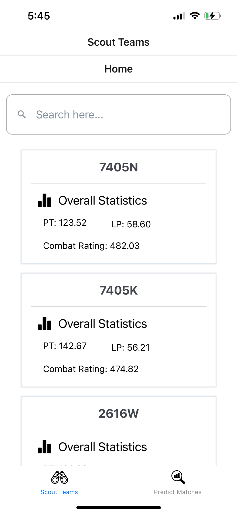
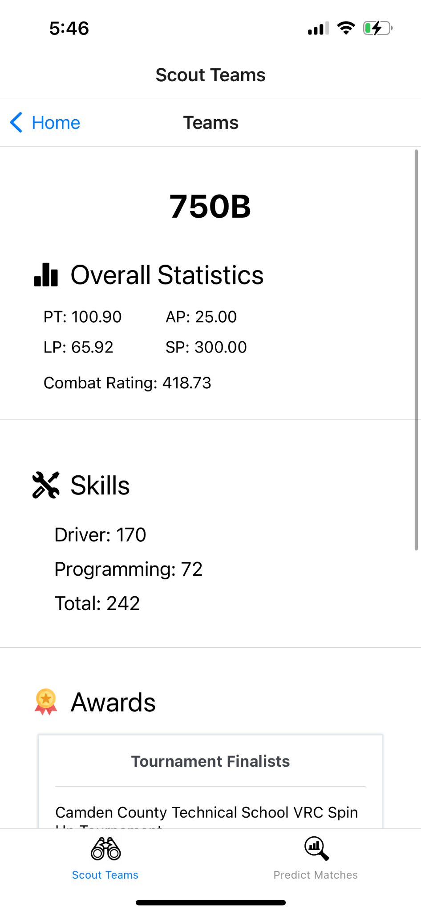
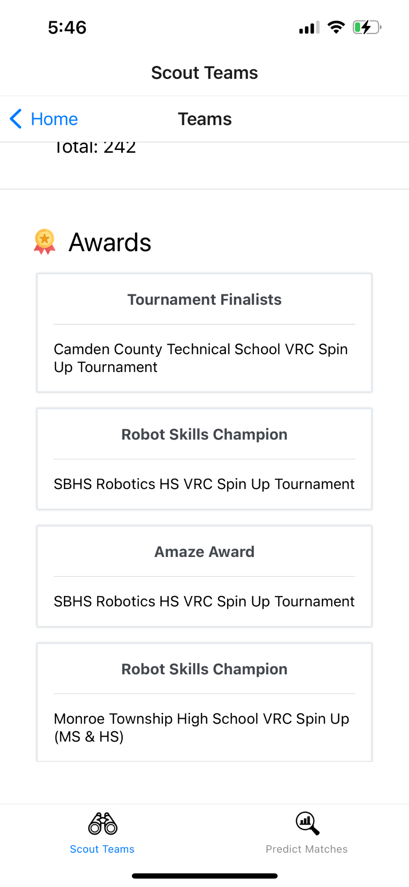
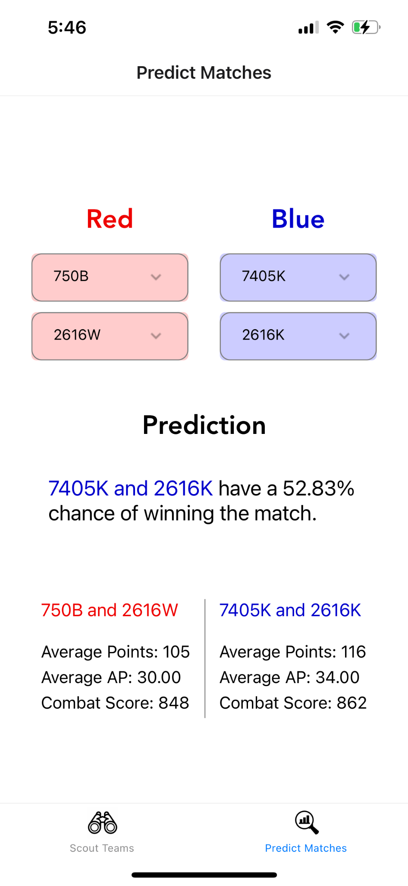

# VEXScoutingApp
A simple app to scout out your opponents for VEX VRC competitions


This project was created in March 2022 for my robotics team (750B). The code has not been uploaded here due to privacy reasons between teams.

# Inspiration

After analyzing high level teams, our team noticed that there was a direct correlation between several variables and the skill of a team.

These factors include:

- Skills Scores (Programming & Driver)
    - A good skills run means that the driver is very good when not defended against.
- Average Points Scored
    - A high value for this means that the team is very good at scoring discs and can consistently score stacks of 3
- Average Points Scored by the opposing alliance
    - If this value is high, it means that the other team is really good so your team didn’t have as many opportunities to score. So, the Average Points Scored by your team is accounted less when this is the case.
- Average AP
    - A high AP means that the team is able to quickly clear out discs during the autonomous portion
- Average SP
    - This helps bias the other factors so that if a team generally plays against worse teams, they’re expected to score more


# Formulating Skill

I sought to quantify this “skill rating” of each time by using all of the previous factors to create a formula.

The derivation of the formula was a painstaking effort as I had to find the correlation between 5 attributes and the skill of a team. I had to continuously adjust the scaling parameters until I got an accurate representation.

In the end, the formula I came up with was:

Let ap = the average ap

Let skp = the highest skills that team had

Let sp = the average sp

Let pt = the number of points the team scores on average

Let opt = the number of points the opposing alliance scores on average


CS = (ptConstant * pt + opt) + (ap * apConstant) + (sp / spConstant) + (skp * skConstant)


Here, CS refers “Combat Rating”, which is essentialy a statistic that determines how good a team is.

After tuning each of the constants, I found that the best approximating for the CS of a team can be found when

    ptConstant = 2		        apConstant = 2.5

    spConstant = 10		        skConstant = 0.4


Plugging in the optimal constants, I found that the overall formula becomes

CS = (2 * pt + opt) + (ap * 2.5) + (sp / 10) + (skp * 0.4)

```
let combatScore = (teamscore + totalpoints) + (ap * 2.5) + (sp / 10) + (skillspts * 0.4);
```


When used on a test data set, I received a score report which I would say is very accurate in terms of what the actual skills of teams are.

However, this formula is still complex and it is not feasible to calculate the CS for numerous teams in a short period.

In addition, a lot of these variables that I used takes into account the team’s performance at previous competitions, which I wouldn’t have ready access to in the short time before alliance selections.


# Preparing the App


The best solution was to create an app which would automatically calculate the CS ratings for each team. This would save you so much time and have much more precision when determining the exact value.

As stated previously, a lot of the information required for determining the CS of a team is from previous competitions. This means that I needed a way to access all the previous competitions that a team has been to.

The solution was for us to use the RobotEvents API. RobotEvents is a site which contains all the data on competitions, including skills runs, awards, and matches. In other words, it had everything I would need for calculating the CS of teams.

After signing up for a authorization token, I was able to get started. I fetched the JSON data from the endpoint and parsed it into a data structure. Once I saved all the relevant data to a file, the UI was ready to be implemented.


I used React Native (a mobile app development framework built on Node.JS) to base our app on.

The app has a list of every single team in NJ and shows a brief summary of the most vital statistics for each of these teams.


Features:
- Sleek search bar to find specific teams with ease
- Sorted list by descending CS rating
- Detailed information on accomplishments and statistics on each team
- Outcome predictions of theoretical matchups


# Prediction Algorithm

Determining who would win is generally not that much of a difficult task. All you need to do is check who has a higher combined CS rating and they’re more likely to win the match.

However, the problem was calculating the percentage of winning. This would mean I needed a more complex comparison between the two CS ratings. This means I would need to derive another formula, this time for the percentage of winning when given the individual CS ratings as the parameters.

The first thing I looked at was that I don’t want the app to simply say “100%” when a team is much better than another team. There is always the likelihood that something may go wrong (expansion DQ or robot link disconnects) and the latter could win.

So, I  needed a function that would approach but never actually reach 100%. This needs to be true for both alliances. In other words, I need to find a function which had two horizontal asymptotes.

The logistic function perfectly fits this description. As x approaches infinity, the function approaches 1. As x approaches negative infinity, the value approaches 0.


The logistic function, also known as the sigmoid function, is used to classify the input into a binary output. It is very commonly used in many Artificial Intelligence models for regression.

In our case, looking at the graph of the equation, I generally want the input values to fall between [-2, 2]. This way, I have the most range for the y-values while still permitting for the value to extend beyond these limits.

I decided to use the difference of their each alliance’s combined Combat Score as our input value for this function. However, the problem is that these values are much too large for the input range that I desired.

So, I had to scale this combined value down so it fits in the input range. This was mostly done through trial and error for example matches. In the end, the value that I ended with was 1/120 for scaling the combat rating.

I have tested out this predict function and are proud to say that it can predict most matches with a great amount of success.


# Screenshots








